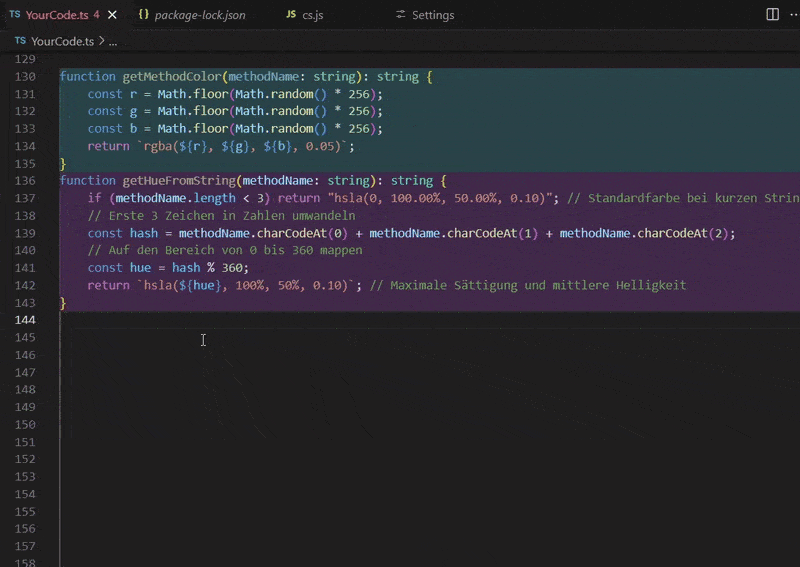

# Method Color Coder

Enhances your code visibility drastically with dynamic decorationsto to automatically highlight all methods with unique color codes

## Features

Your VS Code extension enables dynamic text decorations, allowing seamless updates and removals while responding to configuration changes in real time. It also detects the active programming language, auto-starts on launch, and integrates customizable activation events for an optimized workflow

## Release Notes
In future release notes will propably come here 

### 0.9.0

Initial release of Method Color Highlighter

## Working with Markdown

You can author your README using Visual Studio Code. Here are some useful editor keyboard shortcuts:

* Split the editor (`Cmd+\` on macOS or `Ctrl+\` on Windows and Linux).
* Toggle preview (`Shift+Cmd+V` on macOS or `Shift+Ctrl+V` on Windows and Linux).
* Press `Ctrl+Space` (Windows, Linux, macOS) to see a list of Markdown snippets.

